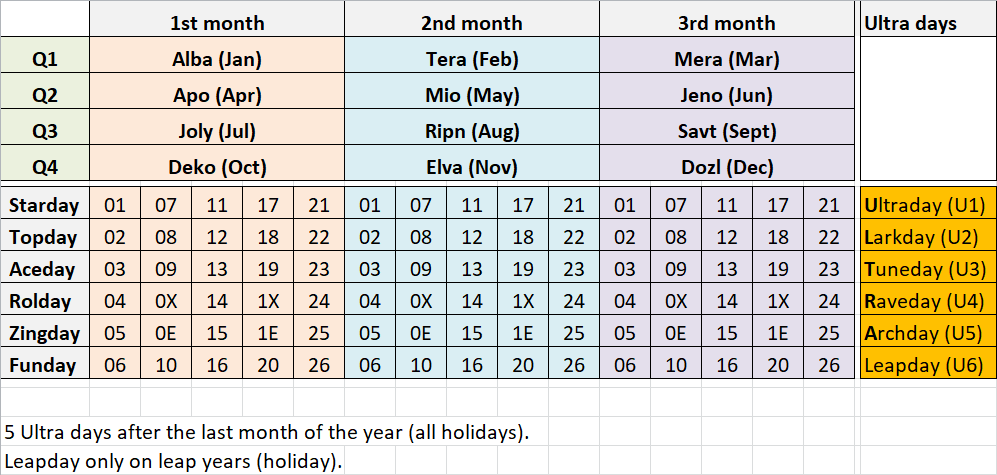

# Starlendar: a calendar system for Star City

This new calendar system is designed for use in Star City (see [Star City manifesto](https://github.com/WebDevBooster/star-city-manifesto)). So, we don't expect anyone else to adopt this calendar. But anyone who wishes to do so is welcome to. 

### The Why

The primary purpose of this calendar system is to do just one thing: 

#### Separate the "chaff from the wheat".

By "chaff" in this case I mean all the individuals attached to the dogma of major organized religions. 

This calendar reform is a simple and super-effective way to filter those people out. They will filter themselves out. Simply because we'll implement this new calendar in Star City. Starlendar will keep all those nutcases away from our city. Here's why: 

1) Individuals attached to the dogma of major organized religions (I won't mention any by name) firmly believe that there's something "divine" about a 7-day week. No, there isn't. Their core belief system is structured around the week having 7 days. And they assign various religious meanings to various days of a 7-day week. In their worldview, a week cannot have anything other than 7 days.

2) Their reliance on a 7-day week is so great that a system without a 7-day week would be completely unacceptable to them. They wouldn't even entertain a thought of living in a world without a 7-day week. Perfect!

That's why I designed Starlendar. 

### The How

I originally conceived this new calendar system back in September 2013. Its original main purpose was to "separate the chaff from the wheat" by doing 2 things: 

1) Implement a 6-day week.

2) Restart the year count.

Restarting the year count is another crucial element of Starlendar. Because the currently most popular calendar system — the Gregorian calendar — has a start date to which many organized religions assign huge significance. 

Nevermind the fact that pope Gregory who commissioned that calendar failed to realize that skipping year 0 is an idiotic thing to do. Think about it... every person is zero years old when they are born. And they become one year old after one year of being alive. And yet, in the Gregorian calendar there's NO year zero. So, what? Did that person who has great significance in many religions instantly become one year old after birth?

That's why skipping year 0 is just plain idiotic. The fact that the Gregorian calendar skips the year 0 is a hint that nobody really knows when that "person" was born or whether he ever existed in the first place. The whole thing is a myth and the Gregorian calendar was designed to perpetuate that myth. 

In Star City we do NOT want to use a calendar system that was commissioned by a pope. We do NOT want to perpetuate the myths that pope Gregory wanted to perpetuate by commissioning the design of that calendar.

But even more importantly: 

Because the start of the Gregorian calendar has such great significance in many organized religions (their faith is literally tied to that start), simply just restarting the year count in an arbitrary year, will be unacceptable to people affected by the dogma. Perfect! 

2011 was the year when I started working on the Star City project. So, I decided to pick that year as year 0 for Starlendar. 

Originally, I wanted the year start in Starlendar to be on 11/11 of 2011 i.e. 11 November 2011. Just having fun with numbers. 

But recently I stumbled upon a thing called [World Calendar](https://en.wikipedia.org/wiki/World_Calendar). Reading through that Wikipedia page made me realize: We don't really need to start our calendar at an odd date like the 11/11. World Calendar was a much less radical reform proposal to the Gregorian calendar and yet the religious nutters have successfully killed it. 

So, given that Starlendar is a much more radical change compared to World Calendar, we can be sure that even if we synchronize the year start (and leap years) with the Gregorian calendar, it will work great for filtering out religious nutcases from Star City. Awesome! 

Also, reading through that Wikipedia page about World Calendar made me realize that... even though World Calendar was a more benign reform proposal (compared to Starlendar), apparently many people and countries were seriously considering World Calendar implementation because of the various benefits listed on that Wikipedia page. 

In other words, on top of fulfilling its main purpose outlined above Starlendar would also give us those same benefits that World Calendar was expected to provide. A BONUS! 

It's a bonus I hadn't even considered when developing Starlendar. But hey, we'll take it! :-) 

### Basic Design

So, in Starlendar we'll have a 6-day week and 5 weeks in a 30-day month.

Originally, I though that the 5 extra days (6 in leap years) would be part of the last month in Starlendar. But the World Calendar was a good inspiration. I got the concept of "intercalary days" or off-calendar days from that. 

**Ultra days** is the name I've chosen for the intercalary days in Starlendar. I gave each ultra day a separate name and made it so that the initials of each ultra day name spell out the word ULTRA. One of the meanings of the [prefix "ultra-"](https://en.wiktionary.org/wiki/ultra-#Prefix) is "greater than normal quantity or importance". Very fitting.

These are the ultra day names: 

* **U**ltraday (U1)
* **L**arkday (U2)
* **T**uneday (U3)
* **R**aveday (U4)
* **A**rchday (U5)

In leap years, we'll also have a **Leapday** as the 6th ultra day.

All ultra days and the Leapday are always meant to be holidays. We'll make sure to have great celebrations on these days in Star City. 

In regular years, the Archday will provide an "arch connection" from the old year to the new. And every 4 years we'll "leap" into the new year on a Leapday. :-)

### Days of the Week

We certainly can't use any of the weekday names from the 7-day week of the Gregorian calendar. Almost all of them have some religious meaning associated with them. We want to completely rid ourselves of that nonsense in Star City. With Starlendar, we want a clean slate without any ambiguity. So, new weekday names are a must. 

Here are the day names of our 6-day week I developed: 

* Starday
* Topday
* Aceday
* Rolday
* Zingday
* Funday

I designed the names so that the initials of the first 5 days spell out STARZ. Rolday incorporates the meanings of both the word "role" as well as "roll" (with emphasis on the former). The meanings of the other days are self-explanatory. 

The name of every day is meant to inspire and/or boost the productivity spirit. One of our long-term aims in Star City is to automate 100% of all the idiotic, boring and tedious jobs. All manual labor shall be automated. So, eventually, we'll only have jobs left that require creativity and thinking but not manual labor. 

And that means: In Star City, "work" will be something people LOVE doing and look forward to. The names for the days of the week are designed to mirror that line of thinking. In Star City, EVERY day of the week is meant to be great. If someone is doing a job where they are "just waiting for the weekend" on a regular workday or have the "can't wait until the weekend" attitude, they need to change their job **immediately**. 

If you "can't wait until the weekend" at any time during the workweek, you aren't doing a job you should be doing. You aren't doing anything that's fulfilling and in that case you should immediately quit that job and change to something that you find fun and fulfilling. 

In Star City, we'll give you all of the learning resources and all the support you'll ever need to gracefully change profession to something you absolutely LOVE doing. Only if you LOVE your job, only then is that job right for you. In Star City, we want you to LOVE your job and only ever do the kind of jobs you love doing.

It's perfectly fine to change careers at any time. Only if you love your job, will you do the best job you can. And when that happens, it's a win-win for you and for Star City. 

Every day of your life will then become an amazingly fun, meaningful, fulfilling real-life video game. Every day of your life you will wake up wanting to do something that'll make Star City even more amazing. The traditional notion of "work" will become ridiculous in Star City. Because on every "workday" in Star City you'll want to PLAY trying to beat your best score.

And once we build the first space elevator in Star City, we'll start a whole new chapter for humanity. Eventually, we'll have dozens of space elevators connecting us to orbit. We'll build the greatest megacity on the planet and **demonstrate** how to solve the biggest problems humanity is facing. 

Star City will serve as a role model for humanity to follow and you will feel incredibly happy that you are allowed to live and work in this city.

Oh, and the first day of the week in Star City will always be a ***workday***. Although the first Starday of the year will be a holiday. 

### Month Names

For obvious reasons, we also must have new month names in Starlendar. Here are the names of the 12 months: 

1) Alba
2) Tera
3) Mera
4) Apo
5) Mio
6) Jeno
7) Joly
8) Ripn
9) Savt
10) Deko
11) Elva
12) Dozl

I designed it so that no name of a month is longer than 4 characters. So, we'll never need abbreviation for month names. Additionally, I made sure that no month name is longer than the corresponding name in the Gregorian calendar. So, the counterpart to May could not be longer than 3 characters thus we have Mio. And Jolly had to be shortened to Joly.

Under those constraints Ripen became Ripn and Saveit became Savt (but with the same pronunciation as "save it"). 

Deko, Elva and Dozl are simply just an allusion to the dozenal system (which will be the primary numeral system in Star City). In dozenal, dek is the equivalent to number 10 in decimal. El is the counterpart to 11 in decimal and Dozl comes from the shortening of dozenal.

Alba is a fun replacement for January (alba means "white"). And the remaining names came from just me having fun while also trying to make mnemonic connections to legacy month names. 

E.g. Mera is an easy mapping to March, Apo to April, Jeno to June, Joly to July etc.

There's also some rhyming going on. And the whole 12-month name sequence would be easy to sing. That's on purpose. 

Savn with the pronunciation of *savin'* would have been even better for rhyming but savin' is too close in pronunciation to *seven*. And since we want to avoid potential confusion, I went with Savt pronounced as "save it".

Mera actually came as an auto-suggestion on my phone as a follow-up to Tera (I was doing a small edit on my phone at the time) and I thought it was a good idea. Looked up "tera mera" later and apparently, in one of the languages on the Indian subcontinent that phrase translates as "our love". Well, why not? It rhymes well! :-)

Mera be the month of love in Starlendar! :-) 

Of course, "ripen" and "save it" only make sense in the Northern hemisphere for those months. And there's certainly nothing "alba" in Australia at the beginning of a year. But hey, names are names. And those will be ours for Starlendar. Although I'm open for better suggestions. 

### Simplicity

Thanks to the inspiration I got from the World Calendar, we now have intercalary days (ultra days) which aren't part of any regular month. 

And that affords us this beautiful simplicity, symmetry and astonishing regularity in Starlendar. Each month and each quarter of the year is identical in length. And every month starts with the first day of the week (Starday) and ends with the last day of the week (Funday). 

Starlendar in decimal:

 

Starlendar in **dozenal**:  
([dozenal will be the primary numeral system in Star City](https://github.com/WebDevBooster/dozenal))

 

### Workdays vs. Restdays

One obvious question might be now: Since a Starlendar week has one fewer days, what about weekends? Or the number of workdays in a week?

A traditional 7-day week typically tends to have 5 workdays (in the Western world) and 2 days of rest for a weekend. How is that supposed to be handled with a 6-day week? Good question!

Here are my thoughts on that: 

Building Star City is NOT gonna be a "walk in the park". Building Star City is gonna require **humongous** effort from everyone involved. If you aren't willing to put extra effort while building Star City, this city is not for you. Stay away! 

That little paragraph right there is all you need to know. 

You are either willing to put in extra effort into building the greatest city on the planet or you aren't. That should be a super-easy decision to make. 

If you are willing, welcome! 

If you aren't, stay the hell away! 

Now, if you are willing to work every single day of the week to build the greatest city on the planet, I'd love to meet you because you think the same way I do. 

However, even if we are eager to make sacrifices and work every single day for the rest of our lives, we should reserve one day of the week for rest and recreational activities. Because this will help us stay healthy und ultimately get more done. 

Therefore I propose: 

During the building phase of Star City i.e. until we build all of the major buildings in all 36 planned districts (to accommodate 108 million residents) **AND** build the first space elevator... until then we should have a 5-day work week with Funday being the rest day of our 6-day week. 

Once that's done, we can let the people of Star City vote as to whether or not we should switch to a 4-day work week with a 2-day weekend. This might be possible given the trend in European countries has been moving toward a 4-day workweek (in a traditional 7-day week).

One of the main aims of Star City is to establish this new mega-city as the undisputed world leader in science and technology. "Establish" means achieve that status and KEEP it up. 

I suspect that due to the vast degree of automation in Star City (far more automation than anywhere else in the world) we'll probably be able to switch to a 4-day work. But ONLY if that won't sacrifice the city's status as the world leader in science and technology. 

So, this will be a matter for debate, data analysis and maybe even a real-world trial to see what happens if we temporarily switch to a 4-day workweek in Star City. We probably won't lose our leadership status if we switch to a 4-day workweek for a year. So, we could try that, gather data and then decide. But only AFTER we finish all of the major buildings and build the first space elevator. 

### Years

And here are the years in Starlendar:

By the way, remember when the world was supposed to end in 2012 because the ancient Mayan calendar had run out of years? 

Well, we can now spin out a new myth saying:  
*Just before the world was about to end because the ancient Mayan calendar had run out of years, the brave people of Star City had invented a new calendar called Starlendar and saved the world!* :-)

### Additional holidays

Since the first Starday of the year will be a holiday (and I think it really should be a holiday), it's kinda annoying because it messes up the perfect workday symmetry in other quarters. I mean, for measuring performance, it would be ideal if each quarter had the same number of workdays. 

To fix this problem, we could add one holiday to each of the other 3 quarters. The best candidates for that would be the first Starday in Mio, the first Starday in Savt and the last Zingday in Dozl.

Also, we should probably ***replace the word "holiday" with something like "celiday"*** (from celebrate). 

